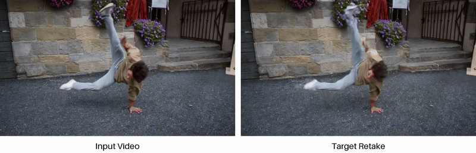
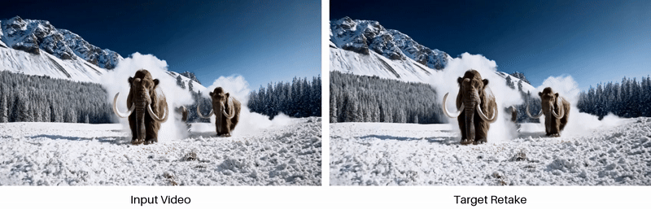

# 🎬 ReDirector: Creating Any-Length Video Retakes with Rotary Camera Encoding

<!-- Arxiv Link, Project Link -->

<a href="https://arxiv.org/abs/2511.19827"></a>
<a href="https://byeongjun-park.github.io/ReDirector/"></a>

<p align="center">
  
  
</p>
<p align="center">
  
  
  
</p>

This repository contains the official implementation of "ReDirector: Creating Any-Length Video Retakes with Rotary Camera Encoding", including both training and inference code.

**🔥Note:** You can adjust config parameters using hydra configs [here](https://github.com/byeongjun-park/ReDirector/blob/main/configs/base.yaml). Feel free to modify them to match your own experimental setup, and if you encounter any issues, please open an issue or contact us. 


## Setup
- Step 1: Install conda envs and download checkpoints:
    ```shell
    conda env create -f environment.yml
    conda activate redirector
    pip install -r requirements.txt
    pip install --no-build-isolation git+https://github.com/mohammadasim98/met3r
    pip install --no-build-isolation -e vipe
    python preprocess/download_model.py
    ```

- Step 2: Prepare the training dataset [MultiCamVideo dataset](https://huggingface.co/datasets/KwaiVGI/MultiCamVideo-Dataset).

- Step 3: Extract features for the faster training:
    ```shell
    torchrun --nproc-per-node=8 preprocess/extract_features.py dataset_path=<path/to/dataset> exract.reverse=true
    torchrun --nproc-per-node=8 preprocess/extract_features.py dataset_path=<path/to/dataset> exract.reverse=false
    ```

## Training
- We train our model for 20k iteration on 8 RTX Pro 6000 Blackwell GPUs. It takes around 90 hours.
    ```shell
    torchrun --nproc-per-node=8 train.py dataset_path=<path/to/dataset>
    ```

## Inference and Evaluation
- Given test the example videos (.mp4 or images directory), we follow ReCamMaster for the preset camera types as below.
    ```shell
    python inference.py eval.ckpt_path=models/step20000.safetensors eval.video_path=example_data/bear eval.cam_type=1 eval.cam_speed=1
    ```

    | cam_type          | Trajectory          |
    |-------------------|---------------------|
    | 1   | Pan Right                         |
    | 2   | Pan Left                          |
    | 3   | Tilt Up                           |
    | 4   | Tilt Down                         |
    | 5   | Zoom In                           |
    | 6   | Zoom Out                          |
    | 7   | Translate Up (with rotation)      |
    | 8   | Translate Down (with rotation)    |
    | 9   | Arc Left (with rotation)          |
    | 10  | Arc Right (with rotation)         |

- The reported metrics in the paper except VBench were obtained by running the code below.
    ```shell
    python evaluate.py --data_path results/bear_camera_1_speed_1.mp4
    ```

## Citation
If you find this repository helpful for your project, please consider citing our work. :)
```
@article{park2025redirector,
  title={ReDirector: Creating Any-Length Video Retakes with Rotary Camera Encoding},
  author={Park, Byeongjun and Kim, Byung-Hoon and Chung, Hyungjin and Ye, Jong Chul},
  journal={arXiv preprint arXiv:2511.19827},
  year={2025}
}
```